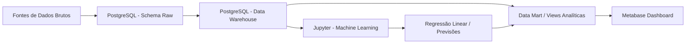

# 🇧🇷 Fatores Socioeconômicos da Criminalidade no Brasil

## 📊 Visão Geral

Este projeto tem como objetivo analisar e prever incidentes de segurança pública no Brasil combinando indicadores socioeconômicos como **Índice de Desenvolvimento Humano Municipal (IDHM)**, **crescimento populacional** e **níveis de educação**.

O objetivo é entender como essas variáveis influenciam as taxas de criminalidade e apoiar a **tomada de decisão orientada por dados** para governos e organizações.

---

## 🎯 Objetivos

* Analisar a relação entre **taxas de criminalidade e fatores socioeconômicos**
* Avaliar o impacto da **educação (INEP/IBGE)** na segurança pública
* Construir um **modelo preditivo** para tendências de criminalidade ao longo do tempo
* Gerar insights para apoiar **alocação de recursos e estratégias de prevenção**

---

## 📌 KPIs do Projeto

Os KPIs estão organizados por área analítica para facilitar o uso em dashboards, Data Mart e Machine Learning.

<details>
<summary><strong>1. População</strong></summary>

| KPI | Indicador | Explicação | Uso |
| --- | --- | --- | --- |
| KPI 1 | População total | Soma a população por município e ano. | Mostra o total médio de habitantes por município/ano e identifica o maior valor observado. |
| KPI 2 | Crescimento populacional | Calcula a variação percentual da população em relação ao ano anterior para cada município. | Mede a tendência de aumento ou queda populacional ao longo do tempo. |

</details>

<details>
<summary><strong>2. IDHM</strong></summary>

| KPI | Indicador | Explicação | Uso |
| --- | --- | --- | --- |
| KPI 3 | IDHM | Representa o Índice de Desenvolvimento Humano Municipal geral. | Calcula a média da base e identifica o maior IDHM observado. |
| KPI 4 | IDHM Renda | Mede a dimensão de renda do desenvolvimento humano. | É um dos componentes usados na análise do IDHM. |
| KPI 5 | IDHM Longevidade | Mede a dimensão de longevidade do desenvolvimento humano. | Indica condições relacionadas à expectativa de vida. |
| KPI 6 | IDHM Educação | Mede a dimensão educacional do desenvolvimento humano. | Reflete o nível educacional médio dos municípios. |

</details>

<details>
<summary><strong>3. Educação</strong></summary>

| KPI | Indicador | Explicação | Uso |
| --- | --- | --- | --- |
| KPI 7 | IDEB | Índice que mede a qualidade da educação com base em rendimento escolar e desempenho. | Foi usado como principal indicador de qualidade do ensino médio. |
| KPI 8 | Fluxo | Indica a progressão/aprovação escolar. | Complementa o IDEB ao mostrar eficiência do percurso escolar. |
| KPI 9 | Aprendizado | Mede o nível de aprendizagem dos estudantes. | Serve para avaliar desempenho educacional. |
| KPI 10 | Nota MT | Nota média em Matemática. | Representa o desempenho em matemática no ensino médio. |
| KPI 11 | Nota LP | Nota média em Língua Portuguesa. | Representa o desempenho em português/leitura. |

</details>

<details>
<summary><strong>4. Segurança Pública - Contagens Absolutas</strong></summary>

| KPI | Indicador | Explicação | Uso |
| --- | --- | --- | --- |
| KPI 12 | Mortes violentas intencionais | Total de mortes violentas intencionais registradas. | Compõe o total de crimes severos analisados. |
| KPI 13 | Homicídios dolosos | Mortes causadas com intenção de matar. | Indicador central de violência letal. |
| KPI 14 | Feminicídios | Homicídios motivados por violência de gênero. | Indicador específico de violência contra mulheres. |
| KPI 15 | Estupros | Total de crimes de estupro registrados. | Entra tanto nas contagens absolutas quanto nas taxas padronizadas. |
| KPI 16 | Furto de veículos | Número de furtos de veículos. | Indicador de crime patrimonial. |
| KPI 17 | Roubo de veículos | Número de roubos de veículos. | Crime patrimonial relevante para análise urbana. |
| KPI 18 | Latrocínios | Roubos seguidos de morte. | Crime grave com impacto direto no índice de violência. |
| KPI 19 | Lesão corporal seguida de morte | Agressão que resulta em morte. | Compõe a análise descritiva de crimes violentos. |

</details>

<details>
<summary><strong>5. Segurança Pública - Taxas por 100 mil Habitantes</strong></summary>

| KPI | Indicador | Explicação | Uso |
| --- | --- | --- | --- |
| KPI 20 | Taxa total de crimes por 100 mil habitantes | Padroniza a criminalidade pela população, permitindo comparação entre municípios. | Principal taxa comparativa entre localidades. |
| KPI 21 | Taxa de mortes violentas intencionais por 100 mil habitantes | Número de mortes violentas intencionais ajustado pela população. | Mostra a intensidade da violência letal. |
| KPI 22 | Taxa de homicídios dolosos por 100 mil habitantes | Homicídios dolosos normalizados pela população. | Facilita comparação entre municípios de tamanhos distintos. |
| KPI 23 | Taxa de feminicídios por 100 mil habitantes | Feminicídios ajustados por população. | Indicador de violência de gênero comparável entre municípios. |
| KPI 24 | Taxa de estupros por 100 mil habitantes | Estupros normalizados pela população. | Mede a incidência proporcional do crime. |
| KPI 25 | Taxa de furto de veículos por 100 mil habitantes | Furtos de veículos padronizados pela população. | Indicador de crime patrimonial comparável. |
| KPI 26 | Taxa de roubo de veículos por 100 mil habitantes | Roubos de veículos ajustados pela população. | Mede a pressão desse tipo de crime em cada município. |

</details>

<details>
<summary><strong>6. Features Temporais</strong></summary>

| KPI | Indicador | Explicação | Uso |
| --- | --- | --- | --- |
| KPI 27 | Lag 1 da taxa de crimes | Taxa de crimes do ano anterior para cada município. | Serve como referência temporal para detectar tendência. |
| KPI 28 | Lag 1 da taxa de mortes violentas | Taxa do ano anterior de mortes violentas intencionais. | Apoia análise de evolução da violência letal. |
| KPI 29 | Variação anual da taxa de crimes | Diferença percentual entre o ano atual e o anterior. | Mostra aceleração ou redução da criminalidade. |

</details>

<details>
<summary><strong>7. Índice de Risco Composto</strong></summary>

| KPI | Indicador | Explicação | Uso |
| --- | --- | --- | --- |
| KPI 30 | Índice de risco | Combina crimes severos normalizados em um único indicador na escala de 0 a 1. | Resume o nível relativo de risco criminal do município. |

</details>

---

## 🏗️ Arquitetura



---

## 🧰 Stack Tecnológica

* **Python** (Pandas, NumPy, Scikit-learn)
* **Jupyter Notebook** (modelagem, experimentos e Machine Learning)
* **PostgreSQL** (dados brutos, Data Warehouse dimensional e Data Marts)
* **pgAdmin** (administração do banco de dados)
* **Metabase** (dashboards e análise de KPIs)
* **Docker & Docker Compose** (ambiente local)
* **Git & GitHub** (colaboração)

---

## 📂 Estrutura do Projeto

```text
.
├── docker-compose.yml
├── docker/
├── README.md
├── datasets/
├── notebooks/
│   └── 01_machine_learning_baseline.ipynb
├── postgres-init/
│   ├── 01-create_and_populate_raw.sql
│   ├── 02-create_and_populate_dw.sql
│   ├── 03-create_datamart.sql
│   └── README.md
├── metabase-data/
├── docs/
└── src/
```

---

## 📊 Fontes de Dados

* Dados de Segurança Pública (criminalidade) - https://forumseguranca.org.br/publicacoes/anuario-brasileiro-de-seguranca-publica/
* Dados de IDHM - http://www.atlasbrasil.org.br/consulta/planilha
* Dados populacionais - https://basedosdados.org/dataset/1e2b9a88-9dc7-4f0e-a3a5-e8d2a13869bf?table=1a8d9636-c11d-443b-ae83-1b00576f0b70
* Dados educacionais do Ministério da Educação - https://qedu.org.br/brasil/baixar-dados?7&brasil

---

## ⚙️ Configuração (Docker)

### 1. Clonar o repositório

```bash
git clone https://github.com/your-username/your-repo.git
cd your-repo
```

### 2. Subir os containers

```bash
docker compose up -d --build
```

---

## 🔗 Serviços

| Serviço          | URL                   |
| ---------------- | --------------------- |
| Jupyter Notebook | http://localhost:8888 |
| PostgreSQL       | localhost:5432        |
| pgAdmin          | http://localhost:8081 |
| Metabase         | http://localhost:3000 |

Nomes dos serviços no Docker Compose:

* `postgres-service`
* `pgadmin-service`
* `jupyter-service`
* `metabase-service`

---

## 🔬 Metodologia

### 1. Carga dos Dados Brutos

* Ler arquivos originais da pasta `datasets/`
* Criar o schema `raw` no PostgreSQL
* Carregar os CSVs em tabelas brutas
* Preservar a estrutura original das fontes sempre que possível

---

### 2. Tratamento e Modelagem Dimensional

* Padronizar formatos e nomes de municípios
* Integrar bases por `código do município + ano`
* Criar dimensões e tabela fato no schema `dw`
* Aplicar boas práticas de modelagem dimensional

---

### 3. Engenharia de Features

* Taxa de crimes por 100 mil habitantes
* Taxa de crescimento populacional
* Indicadores educacionais
* Indicadores de IDHM
* Índice de risco

---

### 4. Modelagem

Usamos um modelo de **Regressão Linear** como primeiro baseline para prever taxas de criminalidade:

$$
crime\_rate = f(IDHM, População, Educação, Tempo)
$$

---

### 5. Data Warehouse

O PostgreSQL organiza o pipeline analítico em schemas:

* `raw`: dados brutos ou quase brutos
* `dw`: modelo dimensional limpo, padronizado e integrado com fatos e dimensões
* `datamart`: views analíticas preparadas para BI e Machine Learning

Fatos principais no `dw`:

* `dw.fato_municipio_ano`: visão consolidada por capital e ano
* `dw.fato_crime_municipio_ano_indicador`: crimes por capital, ano e tipo de indicador
* `dw.fato_populacao_municipio_ano_demografia`: população por capital, ano, sexo e grupo de idade
* `dw.fato_educacao_uf_ano`: indicadores educacionais por UF, ano, ciclo e dependência administrativa

---

### 6. Visualização

Dashboards construídos no **Metabase**:

* Distribuição regional da criminalidade
* Análise de correlação
* Ranking de risco
* Tendências ao longo do tempo
* Monitoramento de KPIs

---

## 🤝 Colaboração

Cada integrante do grupo é responsável por uma área específica:

* Engenharia de Dados (ETL SQL, PostgreSQL e publicação no DW)
* Machine Learning
* Modelagem de Banco de Dados
* Dashboards & Visualização
* Documentação

### Fluxo de Trabalho

* Branches por funcionalidade
* Pull Requests
* Revisões de código

---

## ⚠️ Limitações

* Variáveis socioeconômicas ainda limitadas
* Possíveis inconsistências entre fontes de dados
* Premissas do modelo linear
* Correlação ≠ causalidade

---

## 🚀 Melhorias Futuras

* Adicionar novas variáveis, como renda e desemprego
* Testar modelos avançados, como ARIMA, Prophet ou modelos baseados em árvores
* Criar scripts de produção para treinamento e versionamento de modelos
* Criar uma API para disponibilizar previsões

---

## 💡 Impacto Esperado

Este projeto permite:

* Melhor **alocação de recursos**
* **Ações preventivas** em regiões de maior risco
* Decisões de **política pública orientadas por dados**

---

## 📄 Licença

Este projeto é destinado a fins educacionais e de pesquisa.

---

## 👤 Autores

* Paulo Paniago 
* Marcelo Kobayashi
* Dimitri Cinnanti
