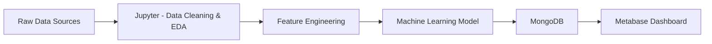

# 🇧🇷 Socioeconomic Drivers of Crime in Brazil

## 📊 Overview

This project aims to analyze and predict public safety incidents in Brazil by combining socioeconomic indicators such as **Human Development Index (HDI)**, **population growth**, and **education levels**.

The goal is to understand how these variables influence crime rates and support **data-driven decision-making** for governments and organizations.

---

## 🎯 Objectives

* Analyze the relationship between **crime rates and socioeconomic factors**
* Evaluate the impact of **education (INEP/IBGE)** on public safety
* Build a **predictive model** for crime trends over time
* Provide insights to support **resource allocation and prevention strategies**

---

## 🧠 Key Questions

* Do regions with lower education levels have higher crime rates?
* How does population growth impact public safety?
* Is education more correlated with crime reduction than HDI?
* Which regions are at higher risk over time?

---

## 🏗️ Architecture



---

## 🧰 Tech Stack

* **Python** (Pandas, NumPy, Scikit-learn)
* **Jupyter Notebook** (EDA & Data Cleaning)
* **MongoDB** (Data storage)
* **Metabase** (Data visualization)
* **Docker & Docker Compose** (Environment setup)
* **Git & GitHub** (Collaboration)

---

## 📂 Project Structure

```
.
├── docker-compose.yml
├── README.md
├── .env.example
│
├── data/
│   ├── raw/
│   ├── processed/
│   └── external/
│
├── notebooks/
│   ├── 01_exploration.ipynb
│   ├── 02_cleaning.ipynb
│   ├── 03_feature_engineering.ipynb
│   └── 04_modeling.ipynb
│
├── src/
│   ├── etl/
│   ├── models/
│   ├── database/
│   └── utils/
│
├── mongo-init/
│   └── init.js
│
└── docs/
    ├── architecture.md
    └── action-plan.md
```

---

## 📊 Data Sources

* Public Safety Data (Criminality datasets)
* HDI Data
* Population Data
* Education Data from Ministério da Educação / INEP / IBGE

---

## ⚙️ Setup (Docker)

### 1. Clone the repository

```bash
git clone https://github.com/your-username/your-repo.git
cd your-repo
```

### 2. Configure environment

```bash
cp .env.example .env
```

### 3. Start containers

```bash
docker-compose up -d
```

---

## 🔗 Services

| Service             | URL                   |
| ------------------- | --------------------- |
| Jupyter Notebook    | http://localhost:8888 |
| MongoDB             | localhost:27017       |
| Mongo Express       | http://localhost:8081 |
| Metabase (optional) | http://localhost:3000 |

---

## 🔬 Methodology

### 1. Data Cleaning

* Handle missing values
* Remove duplicates
* Normalize formats
* Align datasets (state + year)

---

### 2. Feature Engineering

* Crime rate per 100k inhabitants
* Population growth rate
* Education indicators
* Time-based features

---

### 3. Modeling

We use a **Linear Regression model** to predict crime rates:

$$
crime_rate = f(IDH, Population, Education, Time)
$$

---

### 4. Evaluation

* Mean Absolute Error (MAE)
* Root Mean Squared Error (RMSE)
* Model interpretation

---

### 5. Visualization

Dashboards built in **Metabase**:

* Regional crime distribution
* Correlation analysis
* Risk ranking
* Trends over time

---

## 🤝 Collaboration

Each team member is responsible for a specific area:

* Data Engineering (ETL & Cleaning)
* Machine Learning
* Database Modeling
* Dashboard & Visualization
* Documentation

### Workflow

* Feature branches
* Pull Requests
* Code reviews

---

## ⚠️ Limitations

* Limited socioeconomic variables
* Possible data inconsistencies across sources
* Linear model assumptions
* Correlation ≠ causation

---

## 🚀 Future Improvements

* Add more variables (income, unemployment)
* Use advanced models (ARIMA, Prophet)
* Deploy API for predictions
* Real-time data pipeline

---

## 💡 Business Impact

This project enables:

* Better **resource allocation**
* **Preventive actions** in high-risk areas
* Data-driven **public policy decisions**

---

## 📄 License

This project is for educational and research purposes.

---

## 👤 Author

Paulo Paniago & Team
